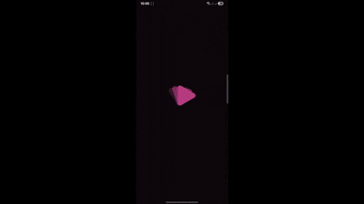
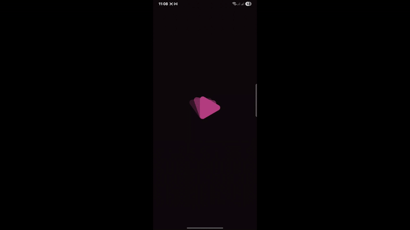

# 🎬 Aflami - Your Ultimate Movie & TV Show Companion
# 🎬 أفلامي - مرافقك الأمثل للأفلام والمسلسلات

<div align="center">

**English**: Discover, explore, and manage your favorite movies and TV shows with Aflami  
**العربية**: اكتشف، واستكشف، ونظم أفلامك ومسلسلاتك المفضلة مع أفلامي

• [🐛 Report Bug](https://github.com/Paris-Squad-S2/Aflami/issues) • [✨ Request Feature](https://github.com/Paris-Squad-S2/Aflami/issues)

</div>

---

## 🌟 Features
- 🎭 **Comprehensive Entertainment Database** - Browse thousands of movies and TV shows
- 🔍 **Advanced Search & Filtering** - Find content by genre, year, rating, and more
- 📱 **Modern UI/UX** - Beautiful Material Design interface with smooth animations
- 🎯 **Personalized Experience** - Create watchlists and manage your favorites
- 🏠 **Smart Home Screen** - Curated recommendations and trending content
- 🔐 **Secure Authentication** - Safe user account management
- 🎮 **Fun Guessing Games** - Interactive entertainment features
- 📊 **Detailed Media Information** - Comprehensive details about movies and shows
- 🌙 **Dark/Light Theme Support** - Comfortable viewing in any environment
- 📱 **Responsive Design** - Optimized for all screen sizes
- 🌐 **Language Support** - Available in English and Arabic

## 📽️ Gifs 

| Dark Mode ( click on gif for high quality video )                                                                                                                                                      |
|--------------------------------------------------------------------------------------------------------------------------------------------------------------------------------------------------------|
| <div align="center"> <a href="https://drive.google.com/file/d/1tFgcD1Key39COI7rTbbN9zOJ7Ftz0Iej/view">  </a> </div> |

| Light Mode ( click on gif for high quality video )                                                                                                                                                     |
|--------------------------------------------------------------------------------------------------------------------------------------------------------------------------------------------------------|
| <div align="center"> <a href="https://drive.google.com/file/d/1eHXZRQvcWl356LC3ev4-SmSe9pXKkhkq/view">  </a> </div> |


## 🚀 Quick Start Guide

### 📋 Prerequisites

Before setting up the Aflami project, ensure you have the following installed:

#### Required Software
- **Android Studio Arctic Fox or later**
- **JDK 11 or higher**
- **Kotlin 1.8.0+**
- **Git** (for cloning the repository)

#### Android SDK Requirements
- **Minimum SDK**: Android 24 (Android 7.0)
- **Target SDK**: Latest available
- **Build Tools**: Latest version

### 🔧 Step-by-Step Setup

#### 1. Clone the Repository

```bash
git clone https://github.com/Paris-Squad-S2/Aflami.git
cd Aflami
```

#### 2. Configure API and Security Settings

Create a `local.properties` file in the root directory of the project:

```properties
# API Configuration
API_TOKEN=your_tmdb_api_key_here

# Keystore Configuration (for release builds)
KEYSTORE_PATH=path/to/your/keystore.jks
KEYSTORE_PASSWORD=your_keystore_password
KEY_ALIAS=your_key_alias
KEY_PASSWORD=your_key_password
```

#### Getting TMDB API Key
1. Visit [The Movie Database (TMDB)](https://www.themoviedb.org/)
2. Create a free account
3. Go to Settings > API
4. Request an API key
5. Use the API key in your `local.properties` file

#### 3. Open Project in Android Studio

1. Launch Android Studio
2. Select "Open an Existing Project"
3. Navigate to the cloned Aflami directory
4. Click "OK" to open the project

#### 4. Sync Project Dependencies

1. Android Studio will automatically prompt to sync the project
2. If not, click "Sync Now" in the notification bar
3. Wait for the Gradle sync to complete
4. Resolve any dependency conflicts if they arise

#### 5. Build and Run

1. Connect an Android device or start an emulator
2. Select your target device from the device dropdown
3. Click the "Run" button (green play icon)
4. The app will build and install on your device

### 🚨 Common Setup Issues & Solutions

#### 1. API Key Issues
**Problem**: App crashes or shows no data  
**Solution**: Verify your TMDB API key is correctly added to `local.properties`

#### 2. Build Failures
**Problem**: Gradle sync or build fails  
**Solutions**:
- Clean and rebuild: `Build > Clean Project` then `Build > Rebuild Project`
- Invalidate caches: `File > Invalidate Caches and Restart`
- Check internet connection for dependency downloads

#### 3. Missing Dependencies
**Problem**: Import errors or missing classes  
**Solution**: Ensure all required SDK components are installed via SDK Manager

#### 4. Keystore Issues (Release Builds)
**Problem**: Cannot build release APK  
**Solution**: Create a keystore file or use debug keystore for testing

## 🛠️ Modular Architecture

### 📋 Overview
Aflami is modularized by feature using **Clean Architecture** and **MVVM**. Each module is independent yet integrates via DI.

#### 🏗️ Module Structure

```
Aflami/
├── 📱 app/
│   └── 🎯 di/                  # Dependency Injection (Hilt setup)
├── 🛠️ buildSrc/                # Build configuration
├── 📊 datasource/
│   ├── 🌐 remote/              # Media, Guess Game, Lists, User
│   └── 💾 local/               # Media, Guess Game, Lists, User
├── 🎨 designsystem/            # UI components and theming
├── 📦 repository/              # Media, Guess Game, Lists, User
├── 🏢 domain/                  # Media, Guess Game, Lists, User
├── 🎯 feature/
│   ├── 🏠 home/                # Home screen
│   ├── 🎮 guessGame/           # Guessing game
│   ├── 📋 lists/               # Watchlists
│   ├── 📂 categories/          # Categories
│   ├── 🔍 search/              # Search
│   └── 👤 user/                # User profile
├── 🖼️ safeimageviewer/        # Hide sensitive content
└── 📝 logger/                  # Firebase crash logging
```

### 🔑 Key Technologies Used

#### Development Stack
- **Language**: Kotlin
- **Architecture**: Clean Architecture + MVVM
- **Dependency Injection**: Hilt
- **Database**: Room
- **Networking**: Retrofit
- **Async Operations**: Coroutines
- **UI**: Material Design Components

#### Additional Libraries
- **Image Loading**: (likely Glide/Coil)
- **Navigation**: Jetpack Navigation
- **Lifecycle**: Android Architecture Components

### 🔧 Technologies
- **Kotlin**, **Jetpack**, **Coroutines**
- **Hilt**, **Room**, **Retrofit**
- **Material Design**, **SafeImageViewer**

## 📱 Running the App

### Debug Build
1. Use Android Studio's run button for immediate testing
2. Debug builds don't require keystore configuration
3. Perfect for development and testing

### Release Build
1. Ensure keystore configuration is correct in `local.properties`
2. Build via: `Build > Generate Signed Bundle/APK`
3. Choose your keystore and credentials

## 🌐 Language Support

The app supports both English and Arabic languages. The appropriate language will be selected based on your device's system language or can be changed within the app settings.

## 🎯 Next Steps After Setup

1. **Explore the codebase**: Start with the `app` module to understand the DI setup
2. **Run the app**: Test all features to ensure everything works
3. **Check the documentation**: Review feature-specific README files in each module
4. **Set up Firebase** (if needed): For crash logging and analytics
5. **Configure CI/CD**: Set up automated builds and testing

## 👥 Team
| Name               | GitHub                                                   |
|--------------------|----------------------------------------------------------|
| Mohamed Elhanafy   | [@Mohamed-Elhanafy](https://github.com/Mohamed-Elhanafy) |
| Mohammed Al-Akkad  | [@mohammed-akkad](https://github.com/mohammed-akkad)     |
| Aziza Helmy        | [@AzizaHelmy](https://github.com/AzizaHelmy)             |
| Haidy AbuGom3a     | [@HaidyAbuGom3a](https://github.com/HaidyAbuGom3a)       |
| Muhammed Wael      | [@MuhammedWael9991](https://github.com/MuhammedWael9991) |
| Mahmoud Abdelnaby  | [@M-Abdelnabi](https://github.com/M-Abdelnabi)           |
| Joseph Sameh Fouad | [@Joseph-Sameh-0](https://github.com/Joseph-Sameh-0)     |
| Ahmed Abdelnasser  | [@ahmedNaser7](https://github.com/ahmedNaser7)           |
| Renad Alalfy       | [@Renad-Alalfy](https://github.com/Renad-Alalfy)         |
| Zeinab             | [@Zeinab979](https://github.com/Zeinab979)               |
| Mustafa Ibrahim    | [@MustafaIbrahim96](https://github.com/MustafaIbrahim96) |
| Dina Othman        | [@DinaOthman21](https://github.com/DinaOthman21)         |
| Ahmed Salah        | [@itsahmedsalah](https://github.com/itsahmedsalah)       |
| asmaa karam        | [@Asmaa7071](https://github.com/Asmaa7071)               |
| Islam Magdy        | [@IslamMagd](https://github.com/IslamMagd)               |
| Yousef Osama Kamal | [@yousef-osama11](https://github.com/yousef-osama11)     |


## 📄 Contributing
1. Fork the repo.
2. Create a branch (`git checkout -b feature/name`).
3. Submit a PR.

## 📞 Getting Help

If you encounter issues during setup:

1. **Check Issues**: Visit the [GitHub Issues page](https://github.com/Paris-Squad-S2/Aflami/issues)
2. **Create New Issue**: If your problem isn't listed, create a new issue with:
    - Your development environment details
    - Error messages or logs
    - Steps to reproduce the problem
3. **Contact Team**: Reach out to the development team for assistance

## 📄 License
[MIT](LICENSE.md)


<div align="center">
    <a href="https://github.com/Paris-Squad-S2/Aflami/issues">
  
</a>
⭐ Star this repo!

**🎉 You're Ready to Start Developing! 🚀**
</div>
